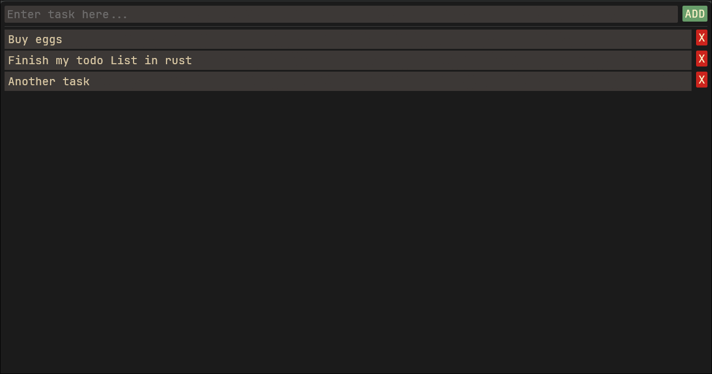

# Todo list v0.0.1
A simple todo-list application written in rust with egui.

## Capabilities
- Add tasks
- Remove tasks
- Show tasks
---
Absolutely nothing else.
Not a proper app so far, just something I made for fun.
## Build instructions
```bash
cargo build
```
There is no bundled easy way to install on your system, you'd have to do that manually.
## License
Code: MIT (see LICENSE).
Bundled font: JetBrainsMono Nerd Font, licensed under the SIL OFL 1.1.
